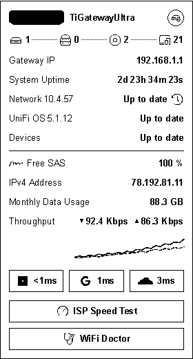

# Design System

A foundation design system for shipping **beautiful apps out of the box** — web,
mobile, and embedded screens — from one pixel-perfect, multi-theme component library.

Every future app stands on this base instead of starting from scratch: the components,
themes, and visual language are already polished, production-grade, and validated.

## Preview

The same component renders across mediums from a single source of truth. Example — the
Gateway status card on a Waveshare 4-colour e-ink panel:

▶︎ **Live, interactive previews:** the full Storybook (all components, `light` / `dark`
/ `eink` themes) is published to GitHub Pages → **https://moifort.github.io/design-system/**

## What it does

- **Component library, Atomic Design** — atoms → molecules → organisms, composed into
  complete screens. Reverse-engineered pixel-for-pixel from a best-in-class network
  console UI.
- **Multi-theme from day one** — `light` and `dark` for screens, `eink` for 4-colour
  embedded panels. Components read every colour and font from the theme, so the *same*
  code renders natively across web, mobile, and embedded displays.
- **Pixel-perfect, always** — each component is validated in Storybook against the
  reference console, so what you see is exactly the real thing.
- **Portable** — hard-coded mock data, no backend; drop components into any React app.

### Components today

- `GatewayCard` — gateway/router status card (device identity, throughput sparkline,
  connection counts, latency, uplink stats), in `light`, `dark`, and `eink`.

## Structure

- `storybook/` — the React + styled-components component library and its Storybook.

> Build, run, theming, and contribution rules live in [`CLAUDE.md`](CLAUDE.md).
